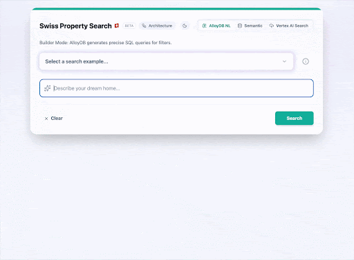

# AlloyDB AI Search Demo

This project is a full-stack demonstration of how to build a modern, AI-powered search application using Google Cloud's **AlloyDB for PostgreSQL**, **Vertex AI** & **Vertex AI Search**.

It showcases four distinct search methodologies enabled by moving AI logic closer to your data, allowing users to interact with a property listing database in intuitive and powerful ways.

## Resources

**📖 Read the Blog Post:** [GenAI Everywhere: Building a Full-Stack AI Search Demo](https://medium.com/@matthiaskupczak/genai-everywhere-building-a-full-stack-ai-search-demo-with-alloydb-vertex-ai-and-agentic-37eb38c3e646)

**📚 Related Documentation:**
*   [AlloyDB AI Natural Language](https://docs.cloud.google.com/alloydb/docs/ai/natural-language-landing)
*   **Conversational Data Agents** (Build natural language experiences on Google Cloud databases):
    *   [AlloyDB for PostgreSQL](https://docs.cloud.google.com/alloydb/docs/ai/data-agent-overview)
    *   [Cloud SQL for PostgreSQL](https://docs.cloud.google.com/sql/docs/postgres/data-agent-overview)
    *   [Cloud SQL for MySQL](https://docs.cloud.google.com/sql/docs/mysql/data-agent-overview)
    *   [Cloud Spanner](https://docs.cloud.google.com/spanner/docs/data-agent-overview)


## Features: The 4 Modes of Search

| Mode | User Intent | Technology Stack | How it Works |
| :--- | :--- | :--- | :--- |
| **NL2SQL (Generative SQL)** | "I have specific, complex criteria." | **AlloyDB AI** (`alloydb_ai_nl` extension) | Converts natural language queries (e.g., "3-bed in Geneva under 6k") directly into a precise SQL `WHERE` clause inside the database. |
| **Multimodal Semantic Search** | "I'm searching by concept, vibe, or look." | **AlloyDB** (`pgvector`) + **Vertex AI** (Text & Multimodal Embeddings) | Uses **Text Embeddings** to find properties by semantic meaning and **Multimodal Embeddings** for visual search to match aesthetic preferences. |
| **Managed Search** | "I want Google-quality search." | **Vertex AI Search** | A fully managed "Search as a Service" that ingests data and provides a pre-tuned API with ranking, typo-tolerance, and hybrid search out-of-the-box. |

## Architecture Overview

This application follows a modern, containerized microservices architecture designed for scalability and security.

### System Components
1.  **Frontend (React + Vite)**: Serves the user interface and communicates with the backend via REST API.
2.  **Backend (FastAPI)**: Handles application logic, orchestrates AI services, and connects to the database.
3.  **AlloyDB Auth Proxy**: A sidecar process that manages secure, encrypted connections to AlloyDB, eliminating the need for handling static database credentials.
4.  **AlloyDB for PostgreSQL**: The primary relational database, enhanced with `pgvector` for semantic search and `alloydb_ai_nl` for natural language to SQL translation.
5.  **Vertex AI**: Provides the AI models for embeddings (text & multimodal) and the fully managed search engine.
6.  **ADK Agent Service**: A dedicated AI Agent built with the Google Agent Development Kit (ADK) that acts as a "Concierge," helping users find properties via natural language chat.
7.  **MCP Toolbox Service**: A Model Context Protocol (MCP) server that exposes AlloyDB tools (like `search-properties`) to the Agent.


### User Interface
The interface is designed to be intuitive, offering four distinct search modes to cater to different user needs.



## Technical Architecture
* **Frontend:** React + Vite (Containerized with Nginx)
* **Backend:** FastAPI (Containerized with Python 3.11)
* **Agent:** Google ADK (Python 3.11) + Gemini 2.5
* **Toolbox:** Model Context Protocol (MCP) Server
* **Database:** AlloyDB for PostgreSQL (with `alloydb_ai_nl` and `vector` extensions)
* **AI Services:** Vertex AI (Embeddings, Multimodal, Search)

## Getting Started

### Prerequisites

#### Tools
* **Google Cloud SDK (`gcloud`)**: Installed and authenticated.
* **Docker**: Installed (for local debugging and building).

### Setup Options

You can choose between two methods to set up the infrastructure:

#### Option 1: Fully Automated (Terraform)
Use Terraform to automatically provision all required resources (Project, AlloyDB, Vertex AI, GCS, IAM).

1.  Navigate to the `terraform/` directory:
    ```bash
    cd terraform
    ```
2.  Follow the detailed instructions in the **[Terraform README](terraform/README.md)**.
3.  **Summary of steps**:
    *   Create `terraform.tfvars` with your project details.
    *   Run `terraform init` and `terraform apply`.
    *   Run `./generate_env.sh` to create the backend configuration.

#### Option 2: Manual Setup / Existing Resources
If you are using an existing project or prefer to set up resources manually, ensure you meet all requirements first.

1.  **Review Prerequisites**: Read the **[Infrastructure Prerequisites](infrastructure_prerequisites.md)** guide to ensure your project, network, and AlloyDB instance are correctly configured.
2.  **Login**:
    ```bash
    gcloud auth login
    gcloud config set project YOUR_PROJECT_ID
    ```
3.  **Configure Environment**:
    Run the setup script to generate your local configuration file (`backend/.env`):
    ```bash
    ./setup_env.sh
    ```
4.  **Database Initialization**:
    If you haven't already, run the SQL scripts in `alloydb artefacts/` to set up the schema and AI extensions.
    *   `alloydb_setup.sql`
    *   `alloydb_ai_nl_setup.sql`

### Deployment

Once your environment is configured (via Option 1 or Option 2):

1.  **Local Debugging** (Optional):
    ```bash
    ./debug_local.sh
    ```
    This mimics the Cloud Run environment locally using Docker and a Bastion host tunnel.

2.  **Deploy to Cloud Run**:
    ```bash
    ./deploy.sh
    ```
    This will build and deploy all services (Backend, Frontend, Agent, Toolbox) to Google Cloud Run.


## Repository Structure
* `backend/`: FastAPI application and Dockerfile.
* `frontend/`: React application and Dockerfile.
* `deploy.sh`: Automated deployment script for Cloud Run.
* `debug_local.sh`: Script for local containerized debugging.
* `alloydb artefacts/`: SQL scripts for database setup.
